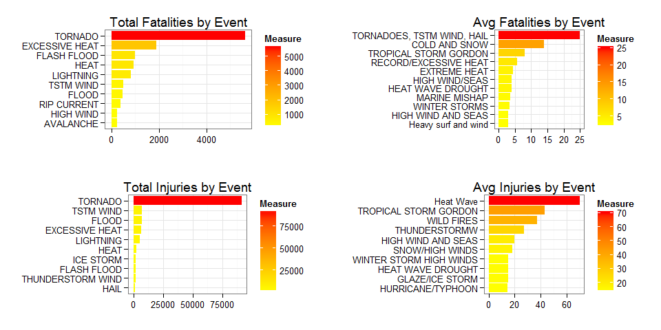
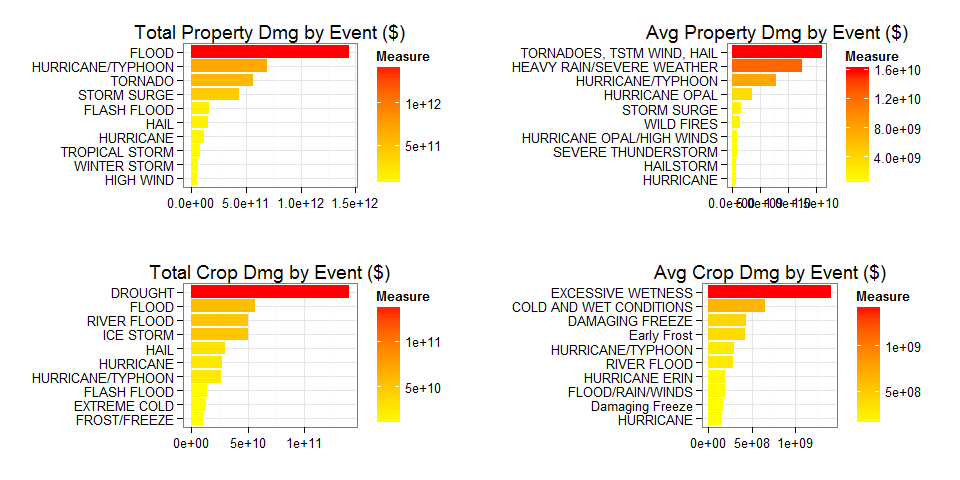

# Health and Economic Impact of Storm Events in the US
Leon Duplay  
8 July 2015  

## Synopsis

Storms and other severe weather events can cause both public health and economic problems for communities and municipalities. Many severe events can result in fatalities, injuries, and property damage, and preventing such outcomes to the extent possible is a key concern.

This analysis uses U.S. National Oceanic and Atmospheric Administration's (NOAA) storm database to evaluate health and economic impact of storm events. This database tracks characteristics of major storms and weather events in the United States, including when and where they occur, as well as estimates of any fatalities, injuries, and property damage. The data is downloaded from the NOAA Storm Database ([link here](https://d396qusza40orc.cloudfront.net/repdata%2Fdata%2FStormData.csv.bz2)) and the analysis addresses the following questions:

* Across the United States, which types of events are most harmful with respect to population health?
* Across the United States, which types of events have the greatest economic consequences?

## Data Acquisition & Processing

In this first step, we download and install all needed libraries (messages off to save space) as well as preparing the data for processing (download & uncompress).

Once the data is loaded, we process the data by cleaning the exponents encoding (from a seperate char column to the correct values), and group the values by type of event. The clean data is now ready for analysis and results.


```r
# install required R.utils package to uncompress .bz2 file
if (!"R.utils" %in% installed.packages()) install.packages("R.utils")

# load needed libraries
library(R.utils)
library(dplyr)
library(ggplot2)
library(gridExtra)
```


```r
# Download and unzip data
url <- "https://d396qusza40orc.cloudfront.net/repdata%2Fdata%2FStormData.csv.bz2"
if(!file.exists("data/Stormdata.csv")) {
    download.file(url,destfile ="data/Stormdata.csv.bz2",method="curl")
    bunzip2("data/Stormdata.csv.bz2",destname="data/Stormdata.csv",overwrite=TRUE)
}

# Load data and transform to data.table
Stormdata <- read.csv("data/Stormdata.csv", header=TRUE, row.names=NULL, 
                    stringsAsFactors=FALSE, na.strings = "NA")

# Clean dataset by subsetting columns
Stormdata <- select(Stormdata, EVTYPE, FATALITIES, INJURIES, PROPDMG, PROPDMGEXP, CROPDMG, CROPDMGEXP)

# Clean exponents
exponent <- function(x) { switch(toupper(x), "K" = 10E3, "M" = 10E6, "B" = 10E9 , 1)}
Stormdata$PROPDMGEXP <- sapply(Stormdata$PROPDMGEXP, FUN="exponent")
Stormdata$CROPDMGEXP <- sapply(Stormdata$CROPDMGEXP, FUN="exponent")
Stormdata <- mutate(Stormdata,PROPDMG = PROPDMG * PROPDMGEXP,CROPDMG = CROPDMG * CROPDMGEXP)
Stormdata <- select(Stormdata, -PROPDMGEXP, -CROPDMGEXP)

# Finish data processing by grouping by EVTYPE
Stormdata <- Stormdata %>% group_by(EVTYPE) %>% summarise_each(funs(sum,mean))
```

## Results

Now we have processed and cleaned the data, we can perform the analysis needed to understand which types of events are most harmful economically and to people's health.

### Weather event impact on health

We start by calculating the top 10 for each bucket, then plot using ggplot2!


```r
# For each measure, calculate top 10
fatalities_sum <- Stormdata %>% select(EVTYPE,FATALITIES_sum) %>% 
    arrange(desc(FATALITIES_sum)) %>% rename(Measure = FATALITIES_sum) %>%top_n(10,Measure)
fatalities_mean <- Stormdata %>% select(EVTYPE,FATALITIES_mean) %>% 
    arrange(desc(FATALITIES_mean)) %>% rename(Measure = FATALITIES_mean) %>% top_n(10,Measure)
injuries_sum <- Stormdata %>% select(EVTYPE,INJURIES_sum) %>% 
    arrange(desc(INJURIES_sum)) %>% rename(Measure = INJURIES_sum) %>% top_n(10,Measure)
injuries_mean <- Stormdata %>% select(EVTYPE,INJURIES_mean) %>%
    arrange(desc(INJURIES_mean)) %>% rename(Measure = INJURIES_mean) %>% top_n(10,Measure)
```


```r
# Multiplot using ggplot2 and gridExtra
noaaplot <- function(datain,titlein) {
    ggplot(data=datain, aes(x=reorder(EVTYPE,Measure), y=Measure, fill=Measure)) +
        geom_bar(stat="identity") + coord_flip() + theme_bw() +
        labs(title=titlein,x="",y="") + scale_fill_gradient(low = "yellow", high = "red")
}
g1 <- noaaplot(fatalities_sum,"Total Fatalities by Event")
g2 <- noaaplot(fatalities_mean,"Avg Fatalities by Event")
g3 <- noaaplot(injuries_sum,"Total Injuries by Event")
g4 <- noaaplot(injuries_mean,"Avg Injuries by Event")
grid.arrange(g1, g2, g3,g4,ncol=2,nrow=2)
```

 

Results show that Tornadoes dominate the sources of weather-related fatalities & injuries in the US, followed by excessive heat and floods. On average, however, specific smaller events have the largest death & injury toll (cold & snow, tropical storm gordon, high wind/seas). 

This data therefore helps assess the risk of different events in regards to human fatalities and injuries, in particular the fact that some rarer events should not be discounted.

### Weather impact on economy

We start by calculating the top 10 for each bucket, then plot using ggplot2!


```r
# For each measure, calculate top 10
propdmg_sum <- Stormdata %>% select(EVTYPE,PROPDMG_sum) %>% 
    arrange(desc(PROPDMG_sum)) %>% rename(Measure = PROPDMG_sum) %>% top_n(10,Measure)
propdmg_mean <- Stormdata %>% select(EVTYPE,PROPDMG_mean) %>% 
    arrange(desc(PROPDMG_mean)) %>% rename(Measure = PROPDMG_mean) %>% top_n(10,Measure)
cropdmg_sum <- Stormdata %>% select(EVTYPE,CROPDMG_sum) %>% 
    arrange(desc(CROPDMG_sum)) %>% rename(Measure = CROPDMG_sum) %>% top_n(10,Measure)
cropdmg_mean <- Stormdata %>% select(EVTYPE,CROPDMG_mean) %>%
    arrange(desc(CROPDMG_mean)) %>% rename(Measure = CROPDMG_mean) %>% top_n(10,Measure)
```


```r
# Multiplot using ggplot2 and gridExtra
g5 <- noaaplot(propdmg_sum,"Total Property Dmg by Event ($)")
g6 <- noaaplot(propdmg_mean,"Avg Property Dmg by Event ($)")
g7 <- noaaplot(cropdmg_sum,"Total Crop Dmg by Event ($)")
g8 <- noaaplot(cropdmg_mean,"Avg Crop Dmg by Event ($)")
grid.arrange(g5, g6, g7,g8,ncol=2,nrow=2)
```

 

Results show that Floods, Hurricanes & Tornadoes are the top 3 weather events causing property damage, in the billions of dollars. On average though, heavy rain can also deal a lot of economic damage in addition.

The risk for crops is different: Drought dominates the economic damage impact, although floods, and excessive wetness, also cause a lot of damage.

These results are interesting as we can assume they are weighted by the sample population, since humans and crops are concentrated in different areas of the US. However, the most damaging events can be quite concentrated in location (i.e. Tornadoes).

## Appendix

This analysis was completed with the below system:


```r
sessionInfo()
```

```
## R version 3.1.3 (2015-03-09)
## Platform: x86_64-w64-mingw32/x64 (64-bit)
## Running under: Windows 7 x64 (build 7601) Service Pack 1
## 
## locale:
## [1] LC_COLLATE=English_United Kingdom.1252 
## [2] LC_CTYPE=English_United Kingdom.1252   
## [3] LC_MONETARY=English_United Kingdom.1252
## [4] LC_NUMERIC=C                           
## [5] LC_TIME=English_United Kingdom.1252    
## 
## attached base packages:
## [1] grid      stats     graphics  grDevices utils     datasets  methods  
## [8] base     
## 
## other attached packages:
## [1] gridExtra_0.9.1   ggplot2_1.0.1     dplyr_0.4.2       R.utils_2.1.0    
## [5] R.oo_1.19.0       R.methodsS3_1.7.0
## 
## loaded via a namespace (and not attached):
##  [1] assertthat_0.1   colorspace_1.2-6 DBI_0.3.1        digest_0.6.8    
##  [5] evaluate_0.7     formatR_1.2      gtable_0.1.2     htmltools_0.2.6 
##  [9] knitr_1.10.5     labeling_0.3     lazyeval_0.1.10  magrittr_1.5    
## [13] MASS_7.3-42      munsell_0.4.2    parallel_3.1.3   plyr_1.8.3      
## [17] proto_0.3-10     R6_2.1.0         Rcpp_0.11.6      reshape2_1.4.1  
## [21] rmarkdown_0.7    scales_0.2.5     stringi_0.5-5    stringr_1.0.0   
## [25] tools_3.1.3      yaml_2.1.13
```
